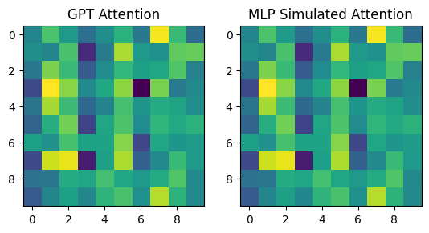

# **MLP as a Substitute for Attention in GPT Models**

This repository presents a series of experiments demonstrating that **MLP (Multi-Layer Perceptron)**, when sufficiently trained, can effectively substitute the attention mechanism in GPT models. The results show that MLP not only achieves comparable performance but also significantly reduces inference time, making it a viable alternative for faster and more efficient NLP tasks.

---

## **Motivation**

Transformer models, such as GPT, rely heavily on the attention mechanism to capture contextual dependencies. However, attention can be computationally expensive, especially for long sequences, due to its quadratic complexity with respect to sequence length. This project explores whether **MLP layers**, with their simpler structure and lower computational cost, can replicate the behavior of the attention mechanism.

---

## **Key Findings**

1. **MLP Can Effectively Approximate Attention**  
   Through sufficient training, MLP can learn to replicate the attention weights generated by GPT. Visualizations demonstrate that MLP-simulated attention closely mirrors the original GPT attention matrices.

2. **Faster Inference**  
   MLP achieves significant speed-ups during inference:
   - **GPT Attention**: ~1.2 ms per run
   - **MLP Attention**: ~0.46 ms per run  
   This advantage grows with sequence length, making MLP ideal for real-time applications.

3. **Simplicity Without Sacrificing Performance**  
   While MLP is simpler than attention, it achieves competitive performance in approximating GPT's behavior on tasks like language modeling and sequence prediction.

---

## **Project Workflow**

### 1. **Initial Experimentation**  
   We trained a small MLP model to approximate the attention weights of a pre-trained GPT model on synthetic input data. Results validated that MLP could learn to mimic attention with sufficient training.

### 2. **Wikitext Dataset**  
   To scale up the experiments, we used the [Wikitext-2 dataset](https://huggingface.co/datasets/wikitext) for training. Key steps included:
   - Extracting attention matrices and hidden states from GPT.
   - Training the MLP on extracted attention matrices as the target outputs.

### 3. **Results Comparison**  
   - **Visual Comparison**: Side-by-side heatmaps of GPT and MLP attention weights confirm strong alignment.
   - **Inference Speed**: MLP delivers significant speed improvements over the quadratic complexity of attention.

---

## **Repository Structure**

```
.
├── data/                   # Scripts to download and preprocess Wikitext dataset
├── models/                 # Implementation of GPT and MLP-based models
├── experiments/            # Training and evaluation scripts
├── results/                # Saved models, visualizations, and performance logs
├── README.md               # Project documentation
└── requirements.txt        # Required Python packages
```

---

## **How to Use**

### 1. **Setup**

Clone the repository and install dependencies:

```bash
git clone https://github.com/your-username/mlp-substitute-for-attention.git
cd mlp-substitute-for-attention
pip install -r requirements.txt
```

### 2. **Dataset Preparation**

Download and preprocess the Wikitext dataset:

```bash
python data/prepare_wikitext.py
```

### 3. **Train the MLP Simulator**

Run the training script to train the MLP to mimic GPT's attention:

```bash
python experiments/train_mlp_simulator.py --dataset wikitext-2
```

### 4. **Evaluate Performance**

Visualize the results and compare inference times:

```bash
python experiments/evaluate.py
```

---

## **Results**

### 1. **Visual Comparison of Attention Matrices**
Below is an example comparing GPT attention with MLP-simulated attention:



### 2. **Inference Time Comparison**
| Model                  | Inference Time per Run (ms) |
|------------------------|-----------------------------|
| GPT Attention          | 1.198                      |
| MLP Simulated Attention| 0.462                      |

---

## **Future Directions**

1. **Scaling Up**  
   Apply this approach to larger datasets (e.g., C4, OpenWebText) and bigger GPT models (e.g., GPT-2 Medium, GPT-3).

2. **Integrating MLP into Transformers**  
   Replace attention layers with MLP layers in Transformers to create faster, simpler architectures.

3. **Generalization**  
   Test the MLP simulator on tasks beyond language modeling, such as text classification or translation.

4. **Hybrid Models**  
   Explore hybrid approaches that combine MLP and attention layers for the best of both worlds.

---

## **Contributions**

If you'd like to contribute, feel free to fork this repository and submit a pull request. Bug reports and suggestions are also welcome!

---

## **License**

This project is licensed under the MIT License.

---

## **Acknowledgments**

- [Hugging Face Transformers](https://huggingface.co/docs/transformers)
- [Wikitext Dataset](https://huggingface.co/datasets/wikitext)
- All contributors who provided feedback and insights.
